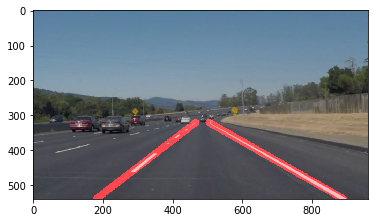
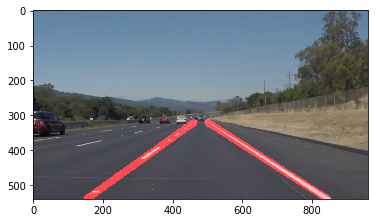
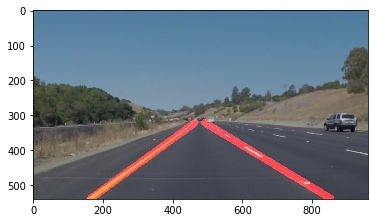
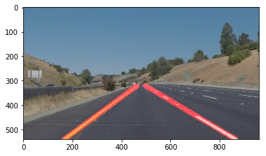
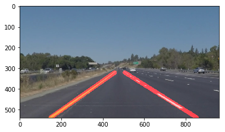
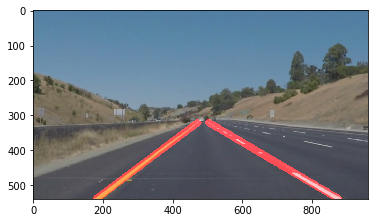

# **Finding Lane Lines on the Road ** 

## The below Algorithm is applied to demark the lane lines in videos and images.

### The goals / steps of this project are the following:

*1. Import all dependencies
*2. Read an image from the directory or video frame.
*3. Pass the image as input to **Pipeline

***Working of pipeline**
*1. The pipeline ***Process_Image*** *have some basic funtions that processes the image and returns the output image with demarcated lane lines.
*2. The first function returns a (black and white) image with white lane lines marked in the region of interest.
*3. The output from above function is fed to next function in pipeline that converts the image into grayscale image.
*4. Next, the grayscale image is fed to another function which removes the gaussian blur from the image.
*5. The highly noise reduced image is fed to canny_function which detects the edges in the ROI(region of interest)
*6. The image is passed to hough_line function which converts the image space into hough space and returns the array if x,y points,
    with each point representing a line in image space .
*7. The array of points is passed to draw_line() function which extrapolates the line into single RED line on both sides of image.
    The complete description of the draw_line() function is below:
    The function takes as input the following parameters: 
    1. Copy of Original image as blank image.
    2. Lines array which contains the starting and End points of each line in image space.
    3. Vertices of region of interest(ROI).
    4. Color and thickness.
    The lines(array) are iterated using "for" loop to get each line(points).
    On each line(x1,y1,x2,y2), that actually contains the starting and end points of line in image space,
    slope is calculated as m=(y2-y1)/(x2-x1).
    if m>0: the points are collected in Right_Points array , 
    else left_points array is filled.
    With slope absolute(m)<.3 , the points are discarded.
    
    Next, we check the length of left_points array, since we need two points to draw a line in specific direction/slope,
    If yes, the two points are taken from the array and slope is calculated.
    Now, we have slope and we need to extrapolate the line from bottom to top of the ROI.
    As we know the bottom and top "y" cordinates , with "m" we can calculate the "x" ordinate for bottom and top.
    After calculating the "x" ordinates, we pass x,y points to cv2.line() function to draw the line on blank image of desired thickness and     color.
    
    ##### The same procedure is repeated for  drawing right lane line.
    #### The output from drawline() function is passed to addweighted() function which combines the Initial image(Original) and demarcated
    ####  blank image to give the final output as below.
    

  
---

### 2. Identify potential shortcomings with your current pipeline

1. As climate is transient in nature. The current algorithm will fail if there is excess sunshine,darkness or shadows on the road.
2. The algorith will only work on the roads with boundaries marked on both sides.
3. During snowing the algorith will give a bloody look of the road, little scary but true, since we have chosen RED color for demarcation.
4. On curves it may fail to work.

### 3. Suggest possible improvements to your pipeline

We can use better framework for color detection like HSL etc for better results.

